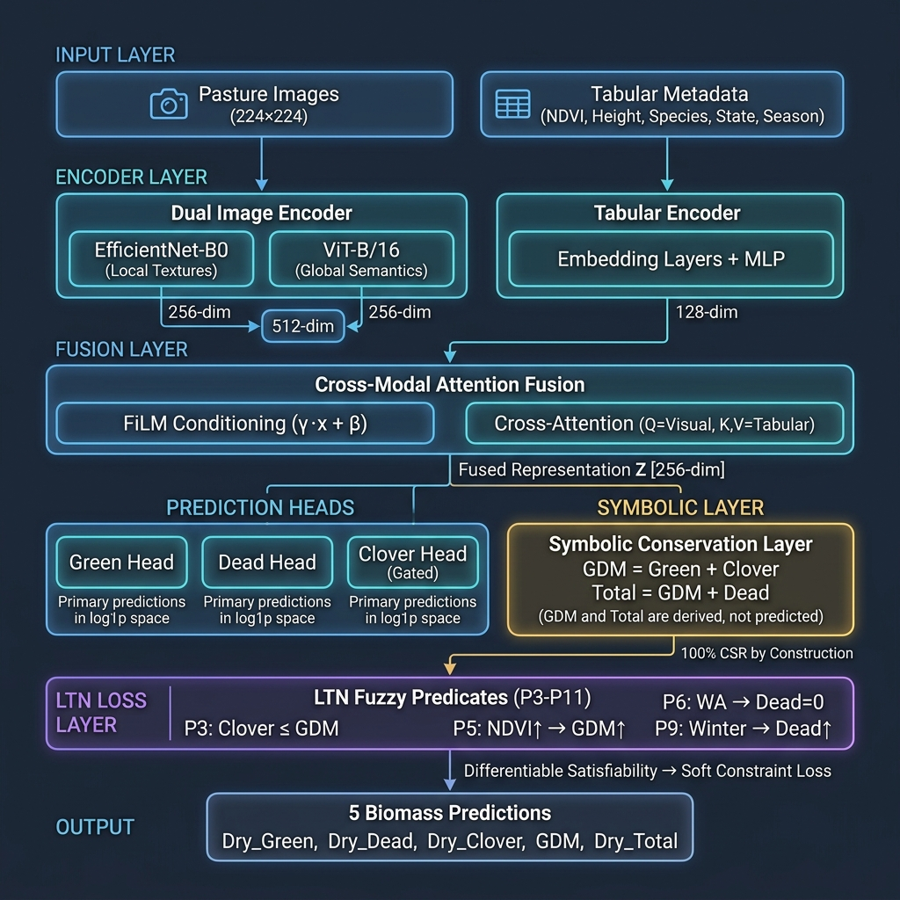

<p align="center">
  
</p>

<h1 align="center">🌿 Neuro-Symbolic Biomass Prediction via Logical Tensor Networks</h1>

<p align="center">
  <strong>AIMS DTU Research Internship 2026</strong><br>
  <em>Multi-modal pasture biomass estimation with ecologically-grounded symbolic constraints</em>
</p>

<p align="center">
  
  
  
  
  
  
</p>

---

## 📋 Table of Contents

- [Overview](#overview)
- [Architecture](#architecture)
  - [Dual Image Encoder](#1-dual-image-encoder)
  - [Tabular Encoder](#2-tabular-encoder)
  - [Cross-Modal Attention Fusion](#3-cross-modal-attention-fusion)
  - [Prediction Heads](#4-prediction-heads)
  - [Symbolic Conservation Layer](#5-symbolic-conservation-layer)
  - [LTN Fuzzy Predicates](#6-ltn-fuzzy-predicates-p3p11)
  - [Loss Function](#7-loss-function)
- [Project Structure](#project-structure)
- [Installation](#installation)
- [Dataset](#dataset)
- [Usage](#usage)
  - [Training](#training)
  - [Running Baselines](#running-baselines)
  - [Notebooks](#notebooks)
- [Results](#results)
  - [Regression Metrics](#regression-metrics)
  - [Constraint Satisfaction Rates](#constraint-satisfaction-rates)
- [Design Decisions](#design-decisions)
- [Limitations & Future Work](#limitations--future-work)
- [License](#license)

---

## Overview

This project tackles the problem of **multi-target pasture biomass prediction** from aerial/field images and auxiliary metadata using a **Neuro-Symbolic AI** approach. The system predicts five biomass components:

| Target | Description |
|:-------|:------------|
| `Dry_Green_g` | Dry green biomass (grams) |
| `Dry_Dead_g` | Dry dead biomass (grams) |
| `Dry_Clover_g` | Dry clover biomass (grams) |
| `GDM_g` | Green Dry Matter = Green + Clover *(derived)* |
| `Dry_Total_g` | Total = GDM + Dead *(derived)* |

### Why Neuro-Symbolic?

Traditional neural networks treat each biomass target independently, frequently violating known biological conservation laws (e.g., predicting `GDM < Clover`, or `Total ≠ Green + Dead + Clover`). This system:

1. **Encodes conservation laws into the architecture** — `GDM` and `Total` are *algebraically derived* from primary predictions, guaranteeing 100% constraint satisfaction.
2. **Injects ecological domain knowledge as differentiable soft rules** — 9 LTN predicates (P3–P11) encode relationships discovered during EDA (e.g., *"NDVI correlates positively with GDM"*, *"WA state → Dead = 0"*) as fuzzy logic constraints that regularize training.
3. **Fuses multi-modal inputs** — pasture images (visual features) and tabular metadata (NDVI, height, species, state, season) are combined via cross-modal attention with FiLM conditioning.

---

## Architecture

The **BiomassLTN** model follows a 6-stage pipeline:

<p align="center">
  
</p>

### 1. Dual Image Encoder

Two pretrained vision backbones extract complementary visual features from 224×224 pasture images:

| Branch | Model | Role | Output Dim |
|:-------|:------|:-----|:-----------|
| **Local** | EfficientNet-B0 (ImageNet) | Texture, vegetation density, color patterns | 256 |
| **Global** | ViT-B/16 (ImageNet) | Semantic composition, spatial relationships | 256 |

Both branches are partially frozen (EfficientNet: first 4 MBConv blocks; ViT: 75% of transformer blocks) and their outputs are concatenated into a **512-dim visual representation**.

```
f_vis = [EfficientNet(x) ‖ ViT_CLS(x)]  →  [B, 512]
```

### 2. Tabular Encoder

Auxiliary metadata is encoded through learned embeddings and a 2-layer MLP:

| Feature | Type | Encoding |
|:--------|:-----|:---------|
| Species | Categorical (15 classes) | Embedding → 32-dim |
| State | Categorical (4 classes) | Embedding → 4-dim |
| Month | Categorical (12 classes) | Embedding → 8-dim |
| Season | Categorical (4 classes) | Embedding → 4-dim |
| NDVI | Continuous | StandardScaler normalized |
| Height | Continuous | log1p → StandardScaler normalized |

```
f_tab = MLP(concat(embeddings, numericals))  →  [B, 128]
```

### 3. Cross-Modal Attention Fusion

Visual and tabular features are fused through a hybrid mechanism:

- **FiLM Conditioning**: Tabular features generate scale (γ) and shift (β) parameters to modulate visual features: `f_img' = γ · f_img + β`
- **Cross-Modal Attention**: Visual features (query) attend to tabular context (key/value)
- **Fusion MLP**: Concatenated representations `[f_img' ‖ f_tab ‖ f_attn]` (768-dim) are projected to a 256-dim fused representation **Z**

```
Z = FusionMLP(f_img_conditioned ‖ f_tab ‖ CrossAttention(f_img, f_tab))  →  [B, 256]
```

### 4. Prediction Heads

Three independent regression heads predict the **primary** biomass components in log1p space:

| Head | Architecture | Notes |
|:-----|:-------------|:------|
| **Green Head** | `Linear(256→128) → GELU → Linear(128→64) → GELU → Linear(64→1) → Softplus` | Standard regression |
| **Dead Head** | Same as Green Head | Standard regression |
| **Clover Head** | Two-stage **Gated** architecture | Binary presence gate × conditional amount regression |

The **Clover Head** uses a novel gated design because many pasture species have structurally zero clover content. A learned sigmoid gate predicts `P(clover > 0)` and multiplicatively gates the regression output, enabling clean zero predictions.

### 5. Symbolic Conservation Layer

This is the architectural core of the neuro-symbolic approach. Instead of predicting all 5 targets independently, the model **derives** `GDM` and `Total` from the primary predictions using exact biological conservation laws:

```
green  = expm1(green_log)     # Back-transform from log1p space
dead   = expm1(dead_log)
clover = expm1(clover_log)

GDM   = green + clover        # Conservation Law 1: GDM = Green + Clover
Total = GDM + dead            # Conservation Law 2: Total = GDM + Dead
```

> **Key Insight**: By encoding conservation laws in the *architecture* rather than the loss function, constraint satisfaction rates (CSR-1 and CSR-2) are **100% by construction** — they can never be violated, regardless of training dynamics.

### 6. LTN Fuzzy Predicates (P3–P11)

Nine differentiable predicates encode ecological domain knowledge as sigmoid-based fuzzy logic with temperature-controlled sharpness (τ):

| Predicate | Rule | Confidence | τ Category |
|:----------|:-----|:-----------|:-----------|
| **P3** | Clover ≤ GDM | 100% (structural) | Hard |
| **P4** | Total ≥ max(components) | 100% (structural) | Hard |
| **P5** | NDVI ↑ → GDM ↑ | ~70% (EDA) | Very Soft |
| **P6** | State = WA → Dead = 0 | 100% (structural) | Near Exact |
| **P7** | Clover-zero species → Clover = 0 | 100% (structural) | Near Exact |
| **P8** | Pure clover species → Dead ≈ 0, Green ≈ 0 | 100% (structural) | Near Exact |
| **P9** | Winter → higher Dead proportion | ~75% (seasonal) | Soft |
| **P10** | Summer → higher Green proportion | ~65% (seasonal) | Soft |
| **P11** | Height ↑ → GDM ↑ | ~68% (EDA) | Very Soft |

Temperature τ is **cosine-annealed** during training, starting broad (forgiving) and tightening as the model improves.

### 7. Loss Function

The total training loss is a weighted combination of three components:

```
L_total = α · L_reg + β(t) · L_ltn + γ · L_gate
```

| Component | Description | Weight |
|:----------|:------------|:-------|
| **L_reg** | Huber loss (δ=2.4) over all 5 targets in log1p space | α = 1.0 |
| **L_ltn** | pMeanError (p=2) over weighted predicate unsatisfactions | β(t) ∈ [0, 0.5], linearly ramped over 5 warmup epochs |
| **L_gate** | Binary cross-entropy on Clover presence gate | γ = 0.3 |

The LTN loss weight β is **linearly warmed up** over the first 5 epochs to let the regression loss stabilize before introducing symbolic constraints.

---

## Project Structure

```
neuro-symbolic-ai/
├── assets/
│   └── architecture_flowchart.png    # Architecture diagram
├── config.yaml                        # All hyperparameters and settings
├── requirements.txt                   # Python dependencies
│
├── src/                               # Core source code
│   ├── main.py                        # Training entry point
│   ├── model.py                       # BiomassLTNModel assembly
│   ├── encoders.py                    # DualImageEncoder + TabularEncoder
│   ├── fusion.py                      # CrossModalAttentionFusion (FiLM + Attention)
│   ├── heads.py                       # RegressionHead + CloverHead (gated)
│   ├── symbolic.py                    # SymbolicConservationLayer (GDM/Total derivation)
│   ├── predicates.py                  # LTN Predicates P3–P11 (fuzzy logic)
│   ├── loss.py                        # TotalLoss (Huber + LTN + Gate BCE)
│   ├── train.py                       # Training and validation loops
│   ├── evaluate.py                    # Metrics, CSR, and evaluation reports
│   ├── dataset.py                     # Data loading, preprocessing, augmentation
│   ├── baselines.py                   # Baseline model definitions (B1–B5)
│   └── run_baselines.py               # Baseline training and comparison pipeline
│
├── notebooks/                         # Jupyter notebooks
│   ├── 01_biomass_eda_ltn_analysis.ipynb    # Exploratory data analysis
│   ├── 02_dataset_and_preprocessing.ipynb   # Data pipeline walkthrough
│   ├── 03_model_and_training.ipynb          # Model architecture and training
│   └── 04_evaluation_and_ablations.ipynb    # Comparative baseline analysis
│
├── data/                              # Dataset (not included in repo)
│   ├── train.csv                      # Training metadata + targets (long format)
│   └── train/                         # Pasture images (JPG)
│
├── outputs/                           # Training outputs
│   ├── checkpoints/                   # Model checkpoints (best_model.pt, last_model.pt)
│   ├── metrics/                       # Evaluation reports and comparative analysis
│   └── scaler.pkl                     # Fitted StandardScaler
│
└── eda_results/                       # EDA outputs
    ├── analysis_report.html           # Summary report
    ├── statistics/                    # Computed statistics
    ├── rules/                         # Extracted rules for LTN predicates
    └── visualizations/                # EDA plots
```

---

## Installation

### Prerequisites

- Python **3.13.11**
- CUDA-compatible GPU recommended (runs on CPU but significantly slower)

### Setup

```bash
# Clone the repository
git clone https://github.com/NotCapt/Neuro-Symbolic-AI.git
cd Neuro-Symbolic-AI

# Create and activate virtual environment
python -m venv venv

# Windows
.\venv\Scripts\activate
# Linux/macOS
source venv/bin/activate

# Install dependencies
pip install -r requirements.txt
```

### Dataset

Download the pasture biomass dataset and place it in the `data/` directory:

```
data/
├── train.csv          # 1785 rows (357 images × 5 targets) in long format
└── train/             # 357 pasture images (JPG)
    ├── ID001.jpg
    ├── ID002.jpg
    └── ...
```

The CSV contains the following columns per row:
- `image_path` — relative path to the image
- `Sampling_Date` — date of sampling
- `State` — Australian state (NSW, QLD, VIC, WA)
- `Species` — pasture species (15 categories)
- `Pre_GSHH_NDVI` — NDVI measurement
- `Height_Ave_cm` — average pasture height (cm)
- `target_name` — one of 5 biomass targets
- `target` — biomass value in grams

---

## Usage

### Training

Train the full BiomassLTN model:

```bash
python src/main.py
```

All hyperparameters are configured in [`config.yaml`](config.yaml). Key settings:

| Parameter | Default | Description |
|:----------|:--------|:------------|
| `training.epochs` | 15 | Total training epochs |
| `training.batch_size` | 16 | Batch size |
| `training.optimizer.lr_backbone` | 1e-4 | Learning rate for image encoder |
| `training.optimizer.lr_other` | 3e-4 | Learning rate for all other parameters |
| `loss.beta_max` | 0.5 | Maximum LTN loss weight |
| `loss.huber_delta` | 2.4 | Huber loss transition point |

Training uses:
- **Differential learning rates**: Slower for pretrained backbones, faster for new layers
- **Cosine annealing** with linear warmup (2 epochs)
- **Curriculum learning**: Downweights high-biomass samples during warmup
- **Gradient clipping**: Max norm = 1.0

### Running Baselines

Run the full comparative baseline study:

```bash
python src/run_baselines.py
```

This trains and evaluates all 5 baseline models:

| ID | Model | Description |
|:---|:------|:------------|
| B1 | XGBoost + Post-hoc Rules | Tabular-only gradient boosting with hard rule corrections |
| B2 | Neural Tabular Only | Tabular encoder + independent regression heads |
| B3 | Neural Image Only | Dual image encoder + independent regression heads |
| B4 | Full Neural (No Constraints) | Multi-modal, no conservation layer, no LTN |
| B5 | Full Neural + Conservation | Multi-modal with conservation layer but no LTN |

### Notebooks

The project includes 4 Jupyter notebooks for interactive exploration:

```bash
jupyter notebook notebooks/
```

| Notebook | Purpose |
|:---------|:--------|
| `01_biomass_eda_ltn_analysis.ipynb` | Comprehensive EDA: distributions, correlations, structural zeros, species/state patterns |
| `02_dataset_and_preprocessing.ipynb` | Data pipeline: pivoting, transforms, augmentation, curriculum sampling |
| `03_model_and_training.ipynb` | Model architecture walkthrough, training visualization |
| `04_evaluation_and_ablations.ipynb` | Baseline comparison, ablation study, CSR analysis |

---

## Results

### Regression Metrics

Performance comparison across all models on the validation set (original space):

#### RMSE ↓ (Lower is Better)

| Model | Dry_Clover | Dry_Dead | Dry_Green | Dry_Total | GDM |
|:------|:----------:|:--------:|:---------:|:---------:|:---:|
| B1: XGBoost | 6.67 | 11.24 | 16.65 | 21.82 | 13.66 |
| B2: Neural Tabular | 12.15 | 15.60 | 34.75 | 48.35 | 37.62 |
| B3: Neural Image | 9.98 | 12.95 | 29.97 | 39.13 | 32.08 |
| B4: Full Neural | 11.75 | 13.67 | 30.02 | 32.28 | 31.27 |
| B5: Neural + Conservation | 11.64 | 13.38 | 27.33 | 34.44 | 29.27 |
| **BiomassLTN (Ours)** | **3.48** | **11.41** | **14.33** | **19.33** | **14.59** |

#### R² ↑ (Higher is Better)

| Model | Dry_Clover | Dry_Dead | Dry_Green | Dry_Total | GDM |
|:------|:----------:|:--------:|:---------:|:---------:|:---:|
| B1: XGBoost | 0.64 | 0.31 | 0.64 | 0.49 | 0.72 |
| B2: Neural Tabular | -0.19 | -0.32 | -0.55 | -1.48 | -1.09 |
| B3: Neural Image | 0.20 | 0.09 | -0.15 | -0.63 | -0.52 |
| B4: Full Neural | -0.11 | -0.02 | -0.16 | -0.11 | -0.44 |
| B5: Neural + Conservation | -0.09 | 0.03 | 0.04 | -0.26 | -0.26 |
| **BiomassLTN (Ours)** | **0.90** | **0.29** | **0.74** | **0.60** | **0.69** |

### Constraint Satisfaction Rates

The CSR metrics demonstrate the core advantage of the neuro-symbolic approach:

| Model | CSR-1 (GDM Conservation) | CSR-2 (Total Conservation) | CSR-3 (Clover ≤ GDM) | CSR-4 (Total ≥ Max) | Symbolic Drift (g) |
|:------|:------------------------:|:--------------------------:|:---------------------:|:-------------------:|:-------------------:|
| B1: XGBoost | 0.15 | 0.15 | 0.94 | 0.75 | 0.00 |
| B2: Neural Tabular | 0.39 | 0.17 | 1.00 | 0.74 | 3.24 |
| B3: Neural Image | 0.22 | 0.29 | 0.97 | 0.81 | 4.28 |
| B4: Full Neural | 0.35 | 0.04 | 1.00 | 1.00 | 10.04 |
| B5: Neural + Conservation | **1.00** | **1.00** | **1.00** | **1.00** | **0.00** |
| **BiomassLTN (Ours)** | **1.00** | **1.00** | **1.00** | **1.00** | **0.00** |

> **Key Takeaway**: Only models with the Symbolic Conservation Layer (B5 and BiomassLTN) achieve perfect constraint satisfaction. The BiomassLTN model additionally achieves the best regression accuracy across nearly all targets due to the soft ecological constraints from LTN predicates P3–P11.

---

## Design Decisions

### Why Encode Conservation Laws in Architecture, Not Loss?

Loss-based penalties (`L_constraint = λ · |Total - Green - Dead - Clover|²`) have several failure modes:
- Constraint satisfaction depends on the penalty weight λ, which requires tuning
- During early training, the optimizer may prioritize regression over constraints
- Constraint violations can persist even after convergence if λ is too small
- There is no guarantee of exact satisfaction at inference time

By deriving `GDM` and `Total` *algebraically* from primary predictions, violations are structurally impossible.

### Why a Gated Clover Head?

The EDA reveals that 4 of 15 species have **exactly zero** clover biomass (100% zero rate). A standard regression head struggles to predict exact zeros. The two-stage gated design:
1. **Gate**: Predicts `P(clover > 0)` — learns to output ~0 for clover-zero species
2. **Amount**: Predicts clover quantity conditional on presence
3. **Output**: `gate × amount` — clean zero predictions for known-zero species

### Why FiLM + Cross-Attention Fusion?

Simple concatenation treats visual and tabular features as independent. FiLM conditioning allows metadata (species, season, state) to *modulate* which visual features are relevant — e.g., "for clover species in summer, attend to green patches differently than for fescue in winter."

### Why Curriculum Learning?

The biomass distribution is heavily right-skewed (many low-biomass samples, few high-biomass outliers). Training initially on easier (low-biomass) samples and gradually introducing hard examples stabilizes early learning.

---

## Limitations & Future Work

### Current Limitations

- **Limited dataset size**: 357 images is relatively small for dual-backbone architectures; results may improve with data augmentation strategies beyond geometric transforms
- **Baseline training epochs**: Due to CPU training constraints, baselines (B2–B5) were trained for only 3 epochs, which may underrepresent their full potential
- **No symbolic-only baseline**: A purely symbolic model (making predictions from rules alone without any learning) is not feasible for this regression task, so the comparative analysis covers neural-only and hybrid approaches
- **Single dataset**: Results are validated on a single pasture biomass dataset from specific Australian regions

### Future Directions

- **Transfer learning to new regions**: Fine-tune on data from different geographies/pasture types
- **Temporal modeling**: Incorporate time-series information for sequential predictions across sampling dates
- **Heteroscedastic regression**: Enable uncertainty estimation through learned variance (infrastructure exists in `HeteroscedasticHead`)
- **Additional predicates**: Incorporate more domain-specific rules as they are discovered from expanded datasets
- **Model distillation**: Compress the dual-backbone architecture for edge deployment

---

## License

This project is developed as part of the AIMS DTU Research Internship 2026.

MIT License — see [LICENSE](LICENSE) for details.
